# How to use IFTTT with ioBroker

Here you learn how to use IFTTT with ioBroker using the Webhooks service of IFTTT. We begin by exploring the 
flow to ioBroker to IFTTT by building a applet sending data from ioBroker via IFTTT to Telegram. Certainly it
is possible using a adapter and thus more direct, but it does give a good example how it works.

+ [Sending data to IFTTT](#sending-data-to-ifttt)
+ [Getting data from IFTTT](#getting-data-from-ifttt)

---

## Sending data to IFTTT ##

We will build an applet doing the following chain: ioBroker => Webhook (IFTTT) => Telegram

**1. To do so, we start by generating a new applet:**


**2. Now start as usual by clicking on "+this", and then select as service Webhooks.**

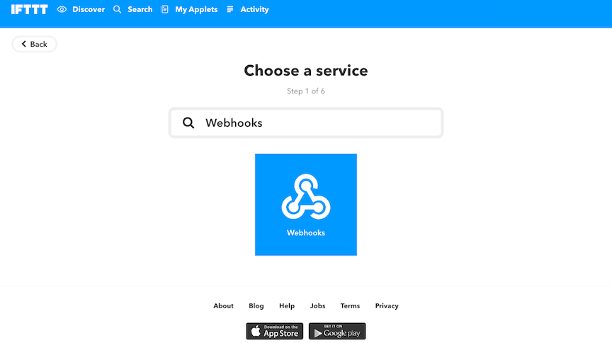

**3. Select here the only available option "Receive a web request" as trigger for the chain.**

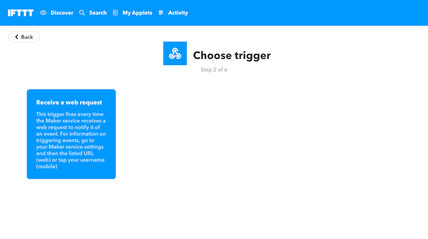

**4. Now we name our event, choose here the same name as you will later in Blocky. For this example lets call it
"state".**

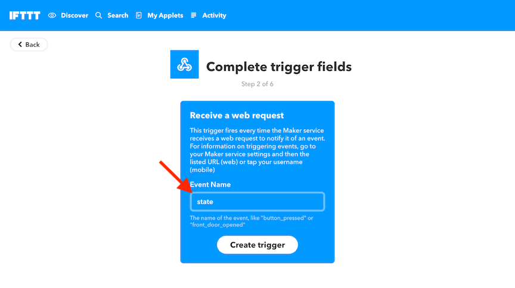

**5. Since we're done with the trigger part of the applet, now we go for the action. To do so click "+then".**

 

**6. Now search for Telegram and click on it (if not your Telegram is not yet linked you need to run through the
 process to do so, this guide assumes that is done).**
 
 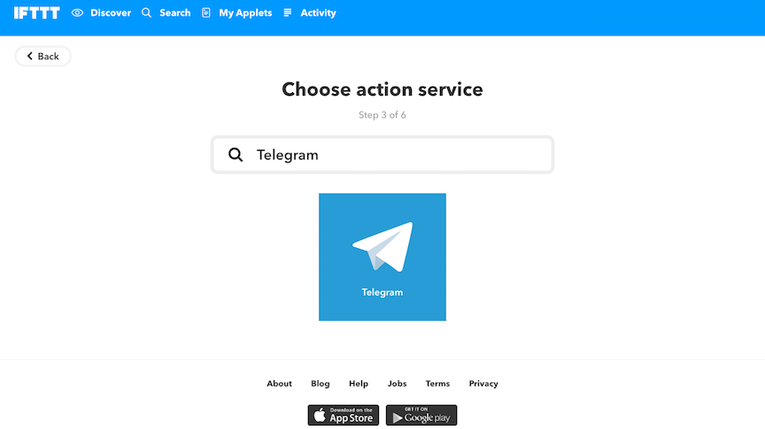
 
 **7. As action choose "Send message".**
 
 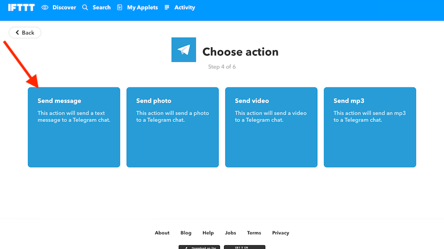
 
 **8. Now we setup where the message should go and how it looks. Please fill the fields as shown in the picture.
 In this sample Value1 will be the ObjectID, Value2 the value of the object and Value3 the ACK state (false/true).**
 
 
 
 **9. We're done with the applet creation, so rename it if you like and hit finish to end the applet creation process.**
 
 
 
 **10. Now we are in need of the key the IFTTT Webhooks service requires us to use for putting in events. To do so
 visit <https://ifttt.com/maker_webhooks> and click on the button "documentation". Then the following page as shown
 below tell you your key, please copy it as we need it for ioBroker in the next step**
 
 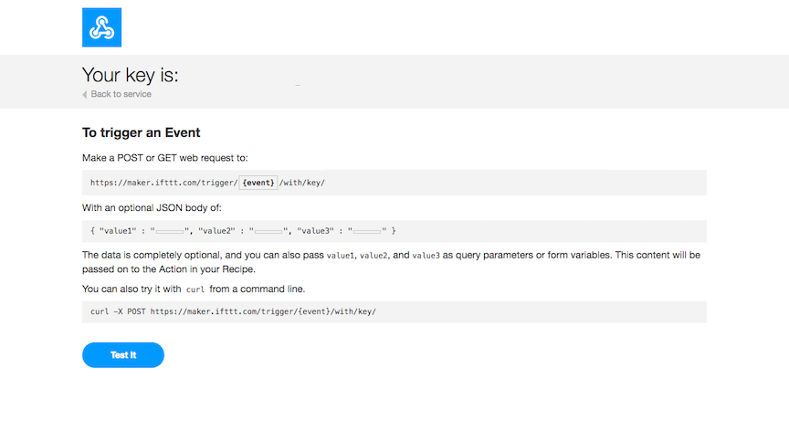
 
 **11. Now go to ioBroker and there to your cloud adapter instance settings page, select the "IFTTT and services"
  tab and paste the key in the field labeled "IFTTT key". (dont even try, the key here is random and just for show)**
  
  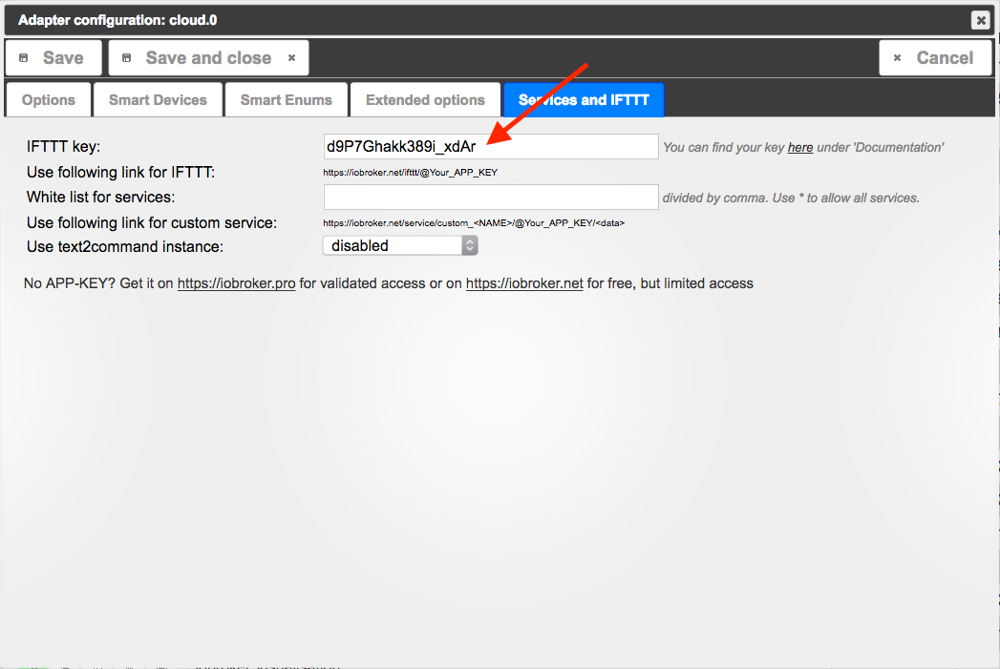
  
  **12. Now we are good to send data to IFTTT using blocky. Here is how the fields of the "send text to IFTTT"
  element (under "Sendto" in Blocky) correspond to the ones we configured as the action in IFTTT.**
  
  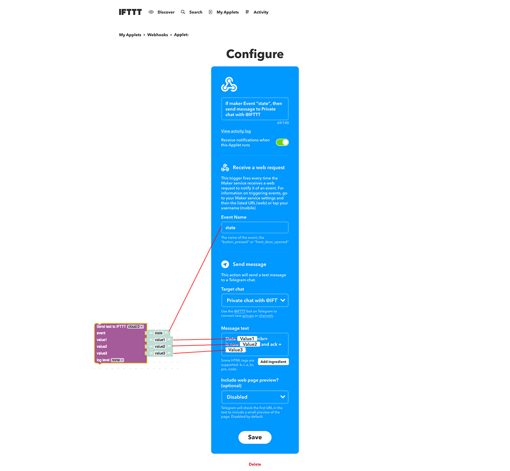
  
  **If you prefer to write javascript directly instead using blocky, the function to use looks like this:**
  
  ```javascript
  sendTo("cloud.0", "ifttt", {
      event: 'state',
      value1: 'value1',
      value2: 'value2',
      value3: 'value3'
  });
  ```
  **Also its possible to set the variable ```cloud.0.service.ifttt``` with some value and it will be send, too.**
  
  **13. As a simple example here a Blocky script which grabs the state of a HomeMatic door contact and sends it to
  IFTTT on a change and the resulting Telegram message.**
  
  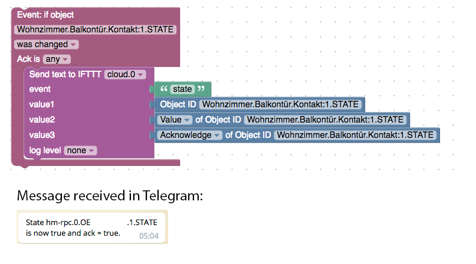  
  
  ---
  
  ## Getting data from IFTTT ##
  
  Now that we know how we can send data to IFTTT and thus to other services, lets see how we can get data back from 
  other services. In this example we go the way the other way round and receive data from Telegram through IFTTT.
  We will build an applet doing the following chain: Telegram => Webhook (IFTTT) => ioBroker
  
  **1. Start by creating a new applet in IFTTT and then click on "+this" to start the trigger selection**
  
  
  
  **2. Now select "Telegram" as your service for the applet.**
  
  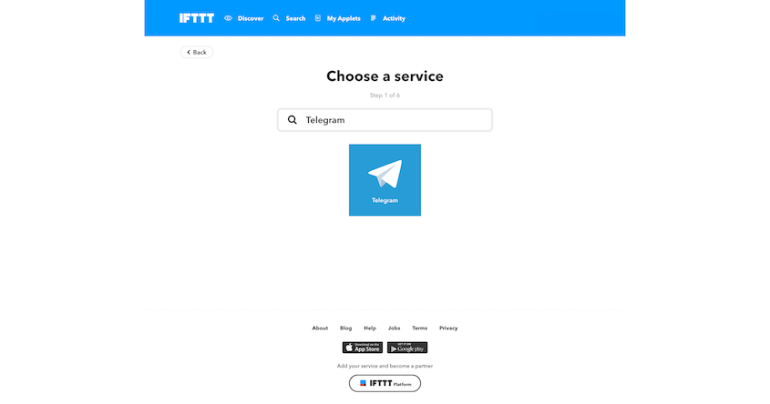
  
  **3. Choose as a trigger here "New message with key phase to @IFTTT".**
  
  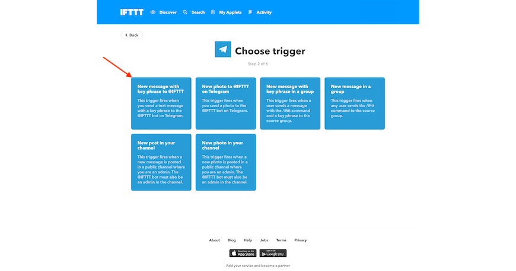
  
  **4. Now put in as key phase "state" and as a reply we take "OK" for this example.**
  
  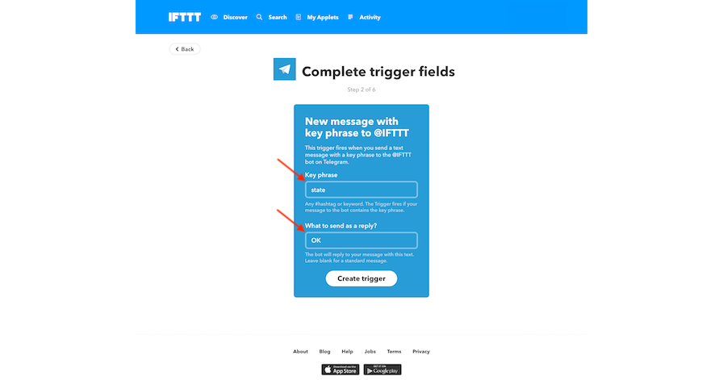
  
  **5. Since we're done with the trigger part of the applet, now we go for the action. To do so click "+then".**

  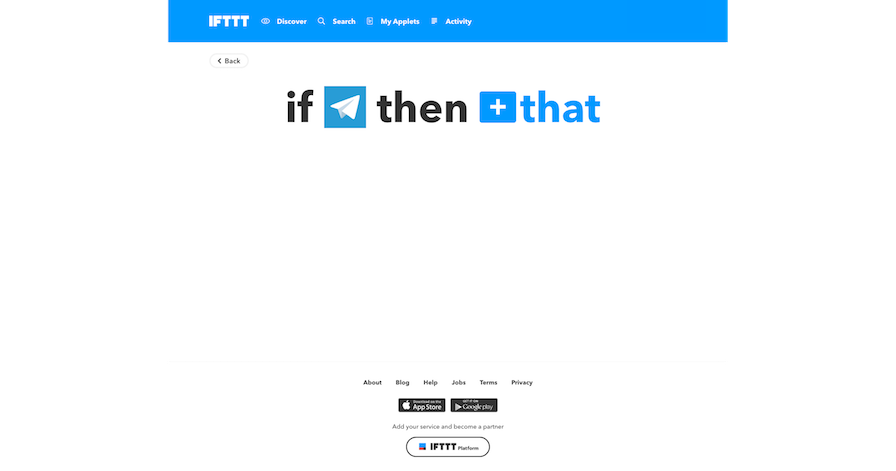
 
 **6. Select "Webhooks" as the action service.**
  
  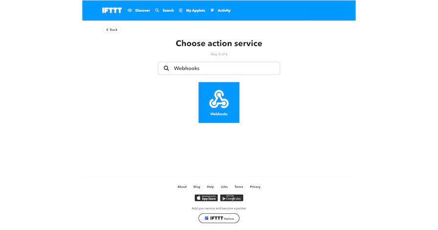
  
 **7. Select the only option "Make a web request" here.**
 
  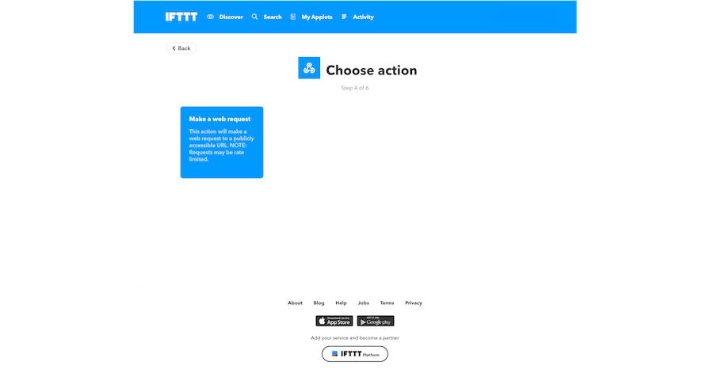
  
  **8. Now we need the API url (requires you having a ioBroker cloud account, either free or pro) from the 
  cloud adapter page, its under the "IFTTT and Services" tab. (oh and don't try, the key in the picture is fake)**
  
  In the case you use custom services, you need set "White list for services" either to "*" to allow
  all services or add "ifttt" to the list of allowed services. If you don't use custom services, ignore this.
  
  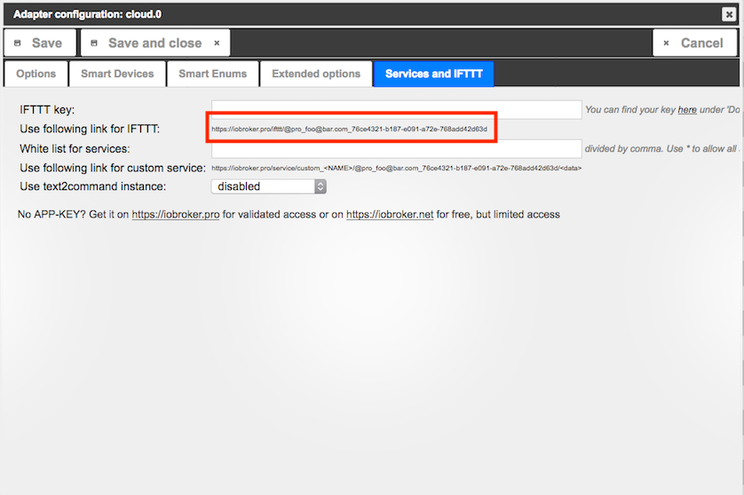
  
  **9. Insert the API url you copied from the cloud adapter configuration into the URL field here. then
  select action "post" and content type "text/plain" and for the body "Text" as the ingredient.**
  
  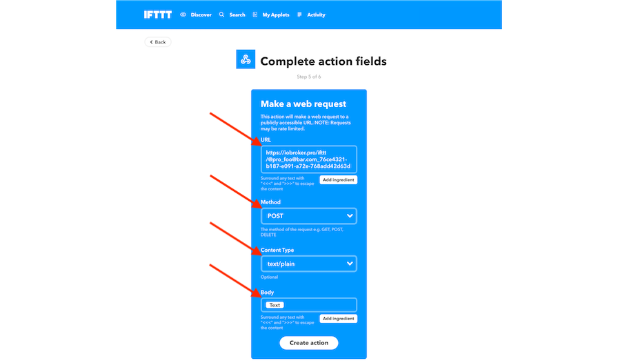
  
   **10. Finish the applet creation process**
   
  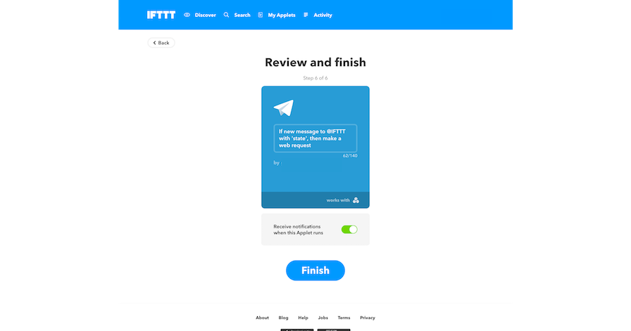
   
   **11. Now if we send a private message to @IFTTT at Telegram like for example "state roflcopter" the variable
    ```cloud.0.service.ifttt``` will contain "roflcopter". This can be captured by any Blocky- or Javascript
    which then can act accordingly.**
    
  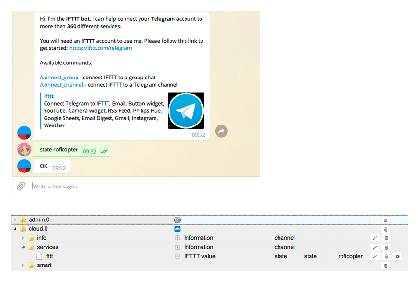
  
  